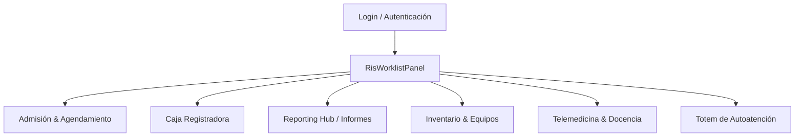

# Documentación Técnica del Sistema RIS (Radiology Information System)

Bienvenido a la documentación oficial del frontend del **Sistema RIS (Radiology Information System)** de MedService. Este sistema es una plataforma SPA (Single Page Application) modular construida con React, Vite, Tailwind CSS e internacionalización (i18n), diseñada para gestionar de forma eficiente el flujo de trabajo de centros de diagnóstico radiológico.

---

## 📂 Estructura de la Documentación

La documentación está dividida en los siguientes secciones para facilitar su lectura y mantenimiento:

| Archivo | Contenido | Público Objetivo |
| :--- | :--- | :--- |
| [📘 Guía de Instalación y Despliegue](./setup.md) | Instrucciones paso a paso para configurar el entorno de desarrollo local y desplegar en producción utilizando Docker y Nginx. | Desarrolladores, Administradores de Sistemas, DevOps |
| [🏗️ Arquitectura y Flujo de Datos](./architecture.md) | Estructura interna del proyecto, manejo de enrutamiento con `react-router-dom`, flujo de autenticación, control de expiración de sesión (24 horas) e internacionalización. | Desarrolladores Frontend, Arquitectos de Software |
| [🧩 Mapeo de Módulos y Componentes](./components.md) | Catálogo e información detallada de cada una de las 24 pestañas del panel (`RisWorklistPanel`) y componentes modales auxiliares. | Desarrolladores Frontend, Diseñadores de UI/UX |
| [🔌 Integración con la API](./api_integration.md) | Configuración de servicios HTTP (`risService.ts`), gestión de tokens de autorización y flujo de subida de archivos adjuntos. | Desarrolladores Fullstack, Desarrolladores Backend |

---

## ⚡ Descripción General del Sistema RIS

El RIS actúa como el núcleo administrativo y operativo del centro médico, conectando el registro de pacientes con el almacenamiento DICOM (PACS), la edición de informes, la facturación y la telemedicina.

### Características Clave:
* **Diseño UI/UX Premium:** Interfaz oscura y fluida basada en Tailwind CSS con transiciones de estado animadas (usando `lucide-react` para iconos).
* **Manejo Completo de Caja:** Control y registro de transacciones mediante apertura y cierre de caja por usuario.
* **Flujo de Trabajo del Informe:** Desde la asignación de plantilla, edición en HTML enriquecido, firma digital y subida de archivos adjuntos (PDFs, imágenes de exámenes previos).
* **Compatibilidad PACS/DICOM:** Vinculación directa mediante `StudyInstanceUID` y `AccessionNumber`.
* **Modo Kiosko (Totem):** Interfaz simplificada para auto-registro de llegada de pacientes y firma de consentimiento.
