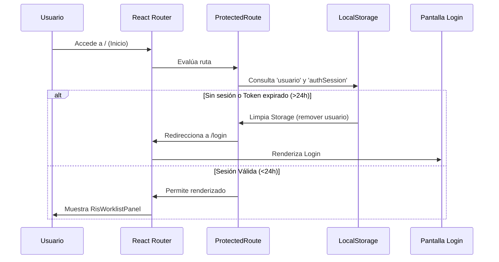

# 🏗️ Arquitectura y Flujo de Datos

Este documento describe la arquitectura de software del frontend del sistema RIS, incluyendo la estructura del directorio, el manejo de rutas protegidas, la gestión de sesiones de usuario y los principios de diseño de interfaz.

---

## 📂 Estructura del Directorio

El proyecto sigue una estructura modular en `/src` para mantener componentes, servicios y vistas agrupados según su dominio de negocio:

```text
src/
├── assets/                 # Recursos estáticos (Logos de la aplicación e iconos)
├── auth/                   # Módulo de Autenticación (Login.tsx, formularios)
├── Organizations/          # Módulo de Organizaciones (Gestión de OID y sucursales)
├── Users/                  # Módulo de Usuarios (Clase del cliente API y configuración)
├── utils/                  # Utilidades comunes (Token.ts, formateadores)
├── RisWorklist/            # Módulo Principal del RIS
│   ├── hooks/              # Custom hooks para peticiones y estados locales
│   ├── components/         # Las 24 vistas modulares (Caja, Informes, etc.)
│   ├── types.ts            # Interfaces y tipado de TypeScript del RIS
│   ├── risService.ts       # Servicios HTTP y consumo de endpoints del RIS
│   └── RisWorklist.tsx     # Panel Dashboard contenedor principal (Sidebar + Tabs)
├── App.css / index.css     # Estilos globales y tokens CSS de Tailwind
├── App.jsx                 # Configuración de enrutamiento principal
├── main.jsx                # Punto de entrada de React (Inicializa i18n y monta la app)
└── i18n.js                 # Configuración de internacionalización (i18next)
```

---

## 🛡️ Enrutamiento y Control de Acceso

El enrutamiento está gestionado por `react-router-dom` v7. En `App.jsx`, se definen las rutas base y se implementa una barrera de seguridad (`ProtectedRoute`) para restringir el acceso a usuarios no autenticados.



### 🔒 Implementación del Guard (`App.jsx`)
El componente `ProtectedRoute` evalúa la existencia del token y la fecha de expiración guardada en localStorage:
* **Llave `usuario`**: Almacena el token de autorización actual y la información básica del usuario.
* **Llave `authSession`**: Almacena un objeto con el token, la información del usuario y un timestamp `expiresAt` con una duración de 24 horas (`Date.now() + 24 * 60 * 60 * 1000`).

Si la hora actual supera a `expiresAt`, se realiza un logout automático (eliminando ambos campos del `localStorage`) y redirigiendo al login.

---

## 🌎 Internacionalización (i18n)

La aplicación cuenta con traducción nativa utilizando `i18next` y `react-i18next`.
* **Inicialización (`src/i18n.js`)**: Configura el idioma español (`es`) por defecto e inicializa los recursos de traducción.
* **Uso en componentes**:
```javascript
import { useTranslation } from 'react-i18next';

function MiComponente() {
  const { t } = useTranslation();
  return <p>{t('clave_de_traduccion')}</p>;
}
```

---

## 🎨 Principios de Diseño de Interfaz y Estilos

El sistema RIS implementa un diseño **Premium Dark Mode** con una paleta de colores personalizada definida en `tailwind.config.js`:

### 🎨 Paleta de Colores Corporativa
* **Fondo Base (`bg-black`):** Color negro puro para maximizar el contraste de las imágenes de diagnóstico médico.
* **Primario-Main (`#066952` / Esmeralda Radiológico):** Utilizado para acentos activos, botones principales y estados confirmados.
* **Secundario-Dark:** Utilizado en sidebars, headers de tablas y fondos de modales, proporcionando profundidad visual (`bg-primary-dark/30`).
* **Degradados Dinámicos:** Fondos de Login y dashboards con elementos difusos (`blur-[120px]`) que otorgan un efecto translúcido y moderno de cristal.

### 📐 Componentes UI Reutilizables
* **`RisModal`:** Envoltura base para modales de toda la aplicación, centrada en pantalla, con fondo semitransparente, cierre rápido (tecla `ESC` o click exterior) y animaciones de entrada.
* **`custom-scrollbar`:** Estilos Tailwind definidos para barras de desplazamiento discretas y delgadas en los paneles de listas largas (ej. pacientes de la lista de trabajo u órdenes pendientes).
